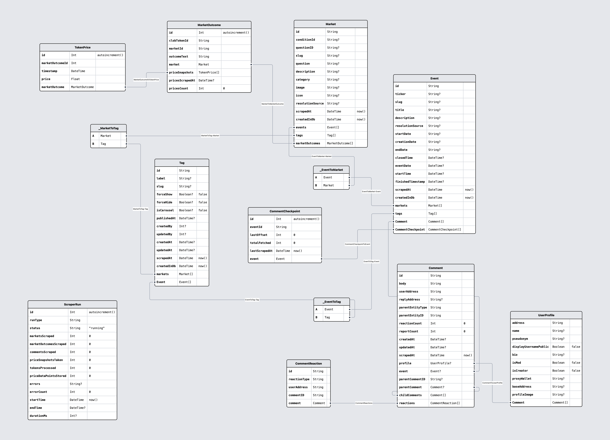

# Computational Tools for Data Science project
## _Polymarket data analysis_

## Data Scraper and Normalizer

For obtaining the data, we created a robust scraper using NestJS CLI. The scraped data is normalized and stored in a PostgreSQL database using Prisma ORM. The scraper efficiently handles market data, comments, and price history while respecting Polymarket's API rate limits.

_Database schema visualization: (Market and Event entities are shown with a reduced set of fields)_
